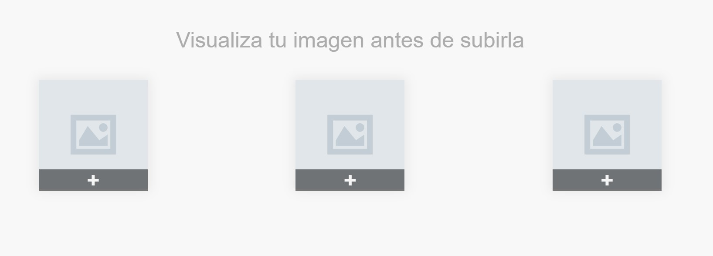
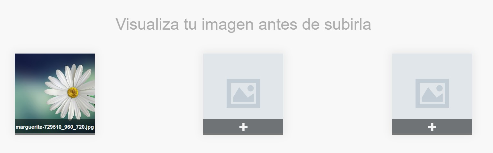
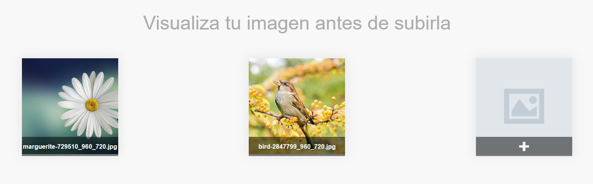
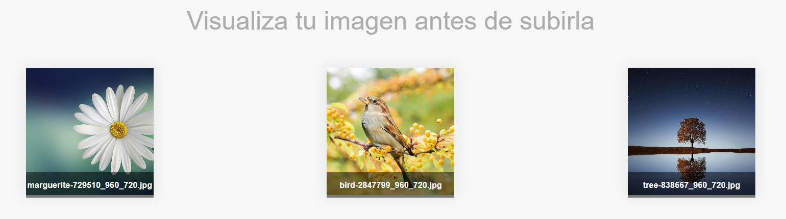

# Previsualizador-de-Imagenes-
un sistema para pre-visualizar imágenes que subamos a nuestras paginas web hecho en HTML, CSS y JavaScript. 

  
    
  
    
  
  

## ¿Cuál es el fin de este proyecto?
Es una simple pagina hecha en HTML, CSS y JavaScript. 
Su objetivo no es mas que el aprendisaje y practica de herramientas que nos puede proporcionar JavaScript.

## ¿Puedo Probarlo en Linea? 
Si, Puedes probarlo en linea haciendo click [aqui](https://carlosorellana00.github.io/Previsualizador-de-Imagenes-/)

## ¿Cómo puedo probarlo de manera local en mi equipo?
puede copiarse directamente desde git a traves de comando o descargarse en un archivo Zip, el proyecto no requiere de ningun servicio de servidor para correrse
de manera local en una computadora.

## Modo de uso

Empezamos por abrir la apliación, esta tendra 3 slots en donde cargar imagenes, al hacer click sobre ellos podremos ver 

  

la imagen cargada en el slot, y su nombre debajo de esta, no es necesario en ningun orden, pero aqui las presentaremos en orden, cargando 3 imagenes

  

  

  

el programa no esta hecho para almacenar imagenes, esto si se quiere hacer se debe agregar de forma posterior, ya que el objetivo del programa es solo el 
previsualizar las imagenes que se suban a una pagina web.

## Agradecimientos y Referencias:

- [Autor -> CodingFlag](https://www.youtube.com/c/Codingflag)
- [Video Original -> How to Preview Image Before Upload using JavaScript](https://www.youtube.com/watch?v=KbeKkmk5nhY)

